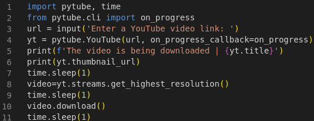

# YTVD - YouTube Video Downloader

## Description:

Application made in Python to download YouTube videos. 

This is an old project that I decided to re-upload to GitHub, with the python up to date and the commits with standards

## Technologies and Standardizations Used:

* Python;
* GIT - Conventional Commits.

## Instructions:

* To activate the Virtual Environment (by PowerShell), execute "/venv/bin/Activate.ps1";
* On your Command Line Interface (CLI) execute the command "python YTVD.py" or "python3 YTVD.py";
* When the application asks for it, copy the link to the clipboard and paste it on your CLI;
* Wait until the download bar reaches 100%;
* The video chosen will be downloaded on the same directory of the project.