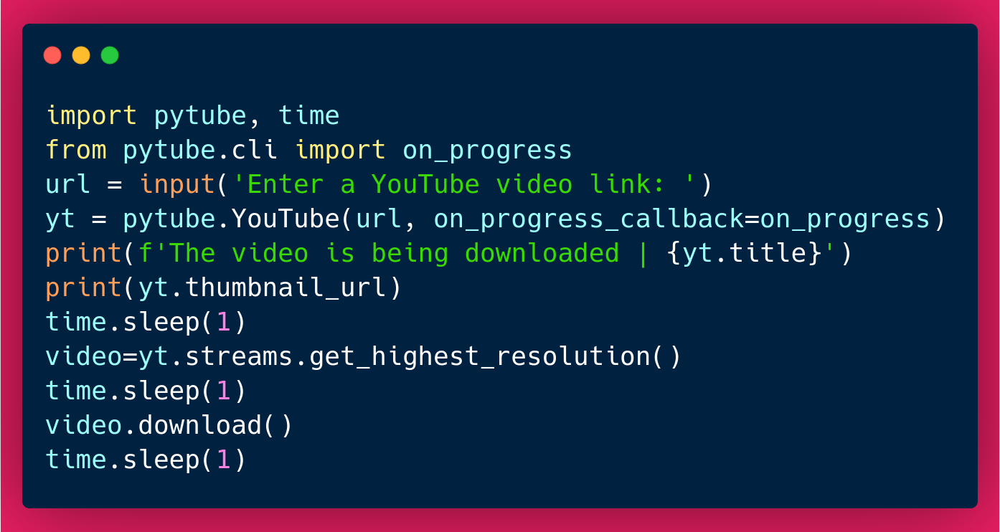
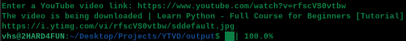
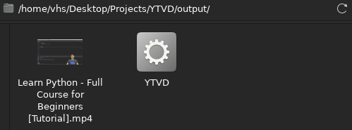

# YTVD - YouTube Video Downloader

## Description:
Application made in Python to download YouTube videos. 

This is an old project that I decided to re-upload to GitHub, with the python up to date and the commits with standards

## Technologies and Standardizations Used:
* Python;
* GIT - Conventional Commits.

## Instructions:

### For Developers:
1. Clone the repository with `git clone https://github.com/VictorHDS/YTVD.git`;
2. To activate the Virtual Environment (by PowerShell), execute `/venv/bin/Activate.ps1`;
3. On your Command Line Interface (CLI) execute the command `python YTVD.py` or `python3 YTVD.py`;
4. When the application asks for it, copy the link to the clipboard and paste it on your CLI;
5. Wait until the download bar reaches 100%;
6. The video chosen will be downloaded on the same directory of the project.

### For Final User:
1. Download the "YTVD.exe" file in "/output";
2. Execute the "YTVD.exe" file;
3. When the application asks for it, copy the link to the clipboard and paste it on your Command Line Interface;
4. Wait until the download bar reaches 100%;
5. The video chosen will be downloaded to the same directory of the "YTVD.exe" file.

## Notes:
* By default, the application downloads videos in the highest possible resolution;
* There is no size limit. It is possible to download any video of any size, taking the necessary time to download it.

## External Links:

* How to use [Pytube](https://pypi.org/project/pytube/);
* How to use [Auto-Py-To-Exe](https://pypi.org/project/auto-py-to-exe/).